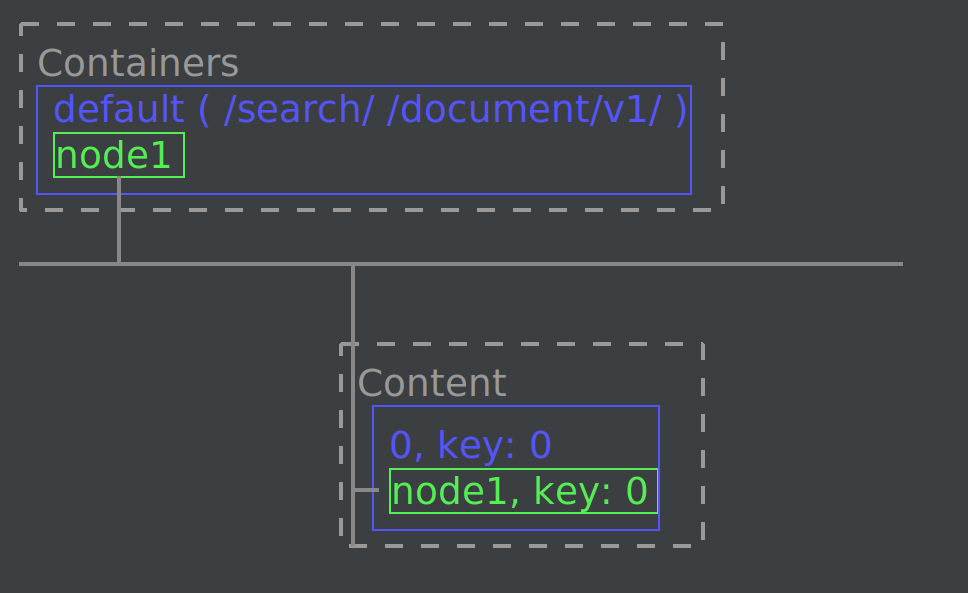
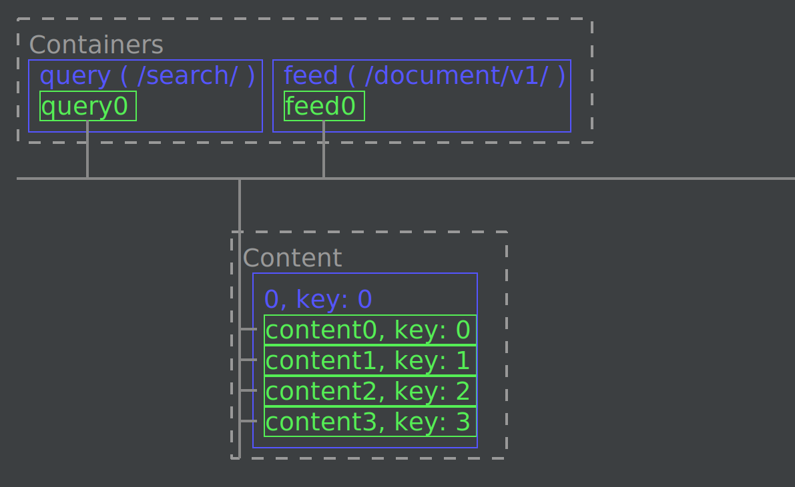

# vespa-yql-plugin

IntelliJ plugin adding support for  [Vespa AI](https://github.com/vespa-engine/vespa) 
[YQL request](https://docs.vespa.ai/en/reference/query-api-reference.html) files.

## Features

<p align="center">

<br/>
</p>

* Run YQL requests against your vespa clusters and present the result in a table.

* Simple highlighting of the request and the yql query value.

* Simple completion support is given for request snippets and the YQL query string.

* Render a tree view of any trace in the YQL response.
  * Optionally render a zipkin view of your trace.
  
* Package, prepare and activate simple vespa applications.
      
* Support for TLS/SSL connections
      
* Simple visualization of services.xml files

## Dependencies

### Vespa Cluster

[Vespa cluster running](https://docs.vespa.ai/en/getting-started.html) with the config 
and query endpoints available (ports 19071, 19050 and 8080/8443). 

See ["Setting up a Vespa cluster for development"](#setting-up-a-vespa-cluster-for-development) on
how to set up vespa clusters for local development/testing.

### Zipkin (Optional)

If you wish to view traces of your Vespa queries you can start a [zipkin server](https://zipkin.io/).

```shell
# Start Zipkin server
docker run --name zipkin -d -p 9411:9411 openzipkin/zipkin

# Stop Zipkin server
docker stop zipkin
# or to remove all data
docker rm -f zipkin
```

## Build &amp; install

```shell
./gradle buildPlugin
# Result goes into build/distributions/ 
ls -l build/distributions/
total 292
-rw-rw-r-- 1 matti matti 294978 mar 25 19:38 vespa-yql-plugin-1.0.0.zip
```

Install the `vespa-yql-plugin-1.0.0.zip` plugin 
file [from disk](https://www.jetbrains.com/help/idea/managing-plugins.html#install_plugin_from_disk)

## Change-Notes

  * [1.0.2] - TLS and simple upload
    * TLS support for connections (not tested on vespa-cloud as I do not have a vespa-cloud)
    * Right click on application dir and select "Package, Prepare and Activate"
      * Onlys zips the dir and calls the prepare and activate function on the config endpoint
      * No support for application code for now.
    * Simple visualization of service.xml files
      * Right-click on a services.xml file and select "Show Service Overview"
    * Show connection status in the Vespa dock
  * [1.0.1] - Fix since-build for idea-version
  * [1.0.0] - First version

## TODOs (Limitations)

* Test TLS connectivity with vespa-cloud
  * We do not have access to a vespa-could to test this.
* Application code support for prepare and activate
  * Support Vespa Java Projects
    * Trigger build before packaging the application
    * Use the generated files in the ./target dir
* When you run a yql request the first time after starting the IDE there will be no results shown.
  * Workaround: just run the query again and results will show.
* Add more tests. The test coverage is VERY low atm.
* Clean up and remove code that is no longer needed!
* Improve the YQL ighlighting


## Setting up a Vespa Cluster for development

Below follows a few instructions on how to set up Vespa clusters for development 
that can be handy when developing a plugin :-)  

### [docker]: single node cluster

The [vespa-cluster/docker](vespa-cluster/docker) dir contains everything you need to set up
a single node vespa cluster with some books to search.

1. Start vespa cluster
    ```shell
    # Start the vespa cluster/node
    docker run --detach --name vespa --hostname vespa-container \
        --publish 8080:8080 --publish 19071:19071 --publish 19050:19050 \
        vespaengine/vespa:8
        
    # Test that the config service is running
    curl -s http://localhost:19071/state/v1/health | jq .
        
    # Stop and remove
    docker rm -f vespa
    ```

1. Deploy the "books" application

   Use the "Package, Perpare and Activate" action in the plugin or:
    ```shell
    cd vespa-cluster/docker
    (cd vespa-app && zip -r - .) | \
    curl -s --header Content-Type:application/zip --data-binary @- \
    http://localhost:19071/application/v2/tenant/default/prepareandactivate | jq .

    # Test that the search and document-api services are running (it can take a while)
    curl -s http://localhost:19071/state/v1/health | jq .
    ```
   
    

1. Add some documents
   ```shell
   cd vespa-cluster/docker
   ./books-insert.sh
   ```
   The ports available are:

   | Port  | Service                                              |
   |-------|------------------------------------------------------|
   | 8080  | Container (for /search/ and /document/v1 REST calls) |
   | 19071 | Config service                                       | 
   | 19050 | Config service                                       | 
   
### [docker-compose]: TLS secured multi node cluster 

The [vespa-cluster/docker-compose](vespa-cluster/docker-compose) dir contains everything 
you need to set up a secured multi node vespa cluster with some books to search.

This is trying to simulate a real production environment where you
have separated query and feed containers and a full zookeeper setup
with multiple content nodes.

All files needed are in the [`vespa-cluster`](vespa-cluster) directory:

1. Setup TLS (these are scripts copied/modified from the [vespa sample-apps](https://github.com/vespa-engine/sample-apps/tree/master/examples/operations/multinode-HA#secure-vespa-with-mutually-authenticated-tls)):
    ```shell
    cd vespa-cluster/docker-compose
    ./scripts/generate-cert-chains.sh
    chmod 644 tls/host.key
    ```

1. Start cluster nodes with docker-compose:
    ```shell
    cd vespa-cluster/docker-compose
    # Run detached
    docker-compose up -d
   
    # Try the secured config endpoint:
    curl  -s \
        --key $(pwd)/tls/host.key \
        --cert $(pwd)/tls/host.pem \
        --cacert $(pwd)/tls/ca-vespa.pem \
        https://localhost:19071/state/v1/health | jq .
       
    # To stop just
    docker-compose stop
    # or (-v will remove the volumes and data)
    docker-compose down -v
    ```

   Docker-compose will create a cluster with the following nodes:

   | Hostname (in vespanet)   | Description | Exposed Ports |
   |--------------------------|-------------|-------------------------|
   | vespa-config-[0-2].vespanet | Configuration nodes | 19071, 19050, 2181      | 
   | vespa-query-0.vespanet   | Container nodes for query services (/search/) | 8080, 8443              |
   | vespa-feed-0.vespanet | Container nodes for feed (/document/v1/) | 9080, 9443              |
   | vespa-content-[0-3].vespanet | Content nodes | n/a                     |

1. Deploy the "books" application

   Use the "Package, Perpare and Activate" action in the plugin or:
    ```shell
    cd vespa-cluster/docker-compose
    (cd vespa-app && zip -r - .) | \
    curl --header Content-Type:application/zip --data-binary @- \
    --key $(pwd)/pki/vespa/host.key \
    --cert $(pwd)/pki/vespa/host.pem \
    --cacert $(pwd)/pki/vespa/ca-vespa.pem \
    https://localhost:19071/application/v2/tenant/default/prepareandactivate
    ```
   

1. Add some documents
    ```shell
    cd vespa-cluster/docker-compose
   
    # Make sure the application is up by probing the document-api port 
    curl  -s \
      --key $(pwd)/tls/host.key \
      --cert $(pwd)/tls/host.pem \
      --cacert $(pwd)/tls/ca-vespa.pem \
      https://localhost:9443/state/v1/health | jq .

   # Insert some data...
   ./books-insert.sh
   ```
   
1. Once the cluster and application is in place, then you can use the `https//localhost:8443/search/` 
   endpoint for queries and the certificates/keys in the 
   [`vespa-cluster/docker-compose/tls`](vespa-cluster/docker-compose/tls) directory for the plugin:

    | Type               | File                                          |
    |--------------------|-----------------------------------------------|
    | CA Certificate     | vespa-cluster/docker-compose/tls/ca-vespa.pem |
    | Client certificate | vespa-cluster/docker-compose/tls/host.pem     |
    | Private key        | vespa-cluster/docker-compose/tls/host.key     |

    The ports available are:

   | Port  | Service                                              |
   |-------|------------------------------------------------------|
   | 8443  | Query container (for /search/ REST calls)            |
   | 9443  | Document-Api container (for /document/v1 REST calls) |
   | 19071 | Config service (first config node)                   | 
   | 19050 | Config service (first config node)                   | 


### [kubernets/kind] multi node cluster 

* To run a vespa cluster locally in kubernetes check out:
  * [vespa-k8s-cluster](https://github.com/pehrs/vespa-k8s-cluster) - vespa cluster running locally with [kind Kubernetes tool](https://kind.sigs.k8s.io/).

## License

https://www.apache.org/licenses/LICENSE-2.0


